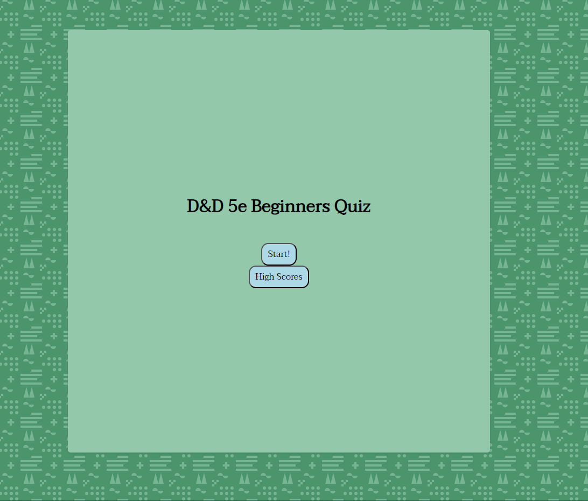

# Homework 4: Web APIs Quiz

## Description
This webpage is a D&D 5th Edition (5e) Beginners Quiz, designed to test your knowledge of the popular tabletop role-playing game. It features a clean and user-friendly interface with a "Start" button to initiate the quiz. Once started, the quiz displays a series of multiple-choice questions related to D&D 5e rules, complete with a countdown timer. As you progress through the quiz, your score updates in real-time.

## Usage

Upon load the page features a start button for the quiz and a button that will take a user to the current leaderboard. Once the start button is clicked, the quiz will begin. The user is taken through a series of 10 questions, the answer of which is among 4 multiple choice buttons. When an answer is selected, the quiz will progress onto the next question. If the answer is correct, the user's score will increase by 10 points and there will be 5 seconds added to the timer. If the question is incorrect, ther is no score change and the timer deducts 5 seconds from the clock. Upon finishing the user is asked to enter their initials to save their score. Once the initials are inputted, then they can click the submit button or hit enter and move on to the Leader Board page. Once here they can see the top 10 scores.

## Access
The page can be accessed here: https://allister-seras.github.io/Hwk4-Quiz/

## License

Please refer to the LICENSE in the repo.
